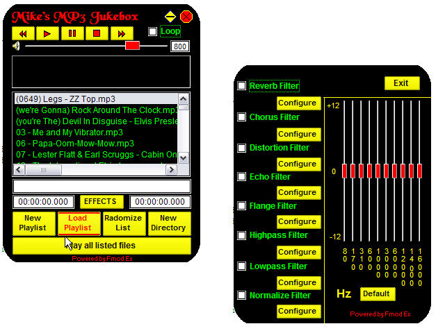



## Mikes MP3 Player UPDATED

### Description

I patterned this after WinAmp. It uses the newest Fmod Ex to drive the sound. It has play lists, looping, name of song playing, shows play length and time elapsed, spectrum analyzer, 10 band equalizer, filters for reverb, chorus, distortion. echo, flange, highpass, lowpass, and

normalize. You can control all aspects of each filter. For the equalizer and filters just push the effects button. Fmod Ex is a commercial library that freeware authors can use for free. I have also used parts of the things I found here. UPDATED: Took out subclassing as I don"t use it anymore. Also updated the routine to open the last directory opened.
 
### More Info
 

             |
---                |---
**Submitted On**   |2005-09-25 18:32:42
**By**             |[Mike Ulik](https://github.com/Planet-Source-Code/PSCIndex/blob/master/ByAuthor/mike-ulik.md)
**Level**          |Intermediate
**User Rating**    |3.3 (20 globes from 6 users)
**Compatibility**  |VB 6\.0
**Category**       |[Sound/MP3](https://github.com/Planet-Source-Code/PSCIndex/blob/master/ByCategory/sound-mp3__1-45.md)
**World**          |[Visual Basic](https://github.com/Planet-Source-Code/PSCIndex/blob/master/ByWorld/visual-basic.md)
**Archive File**   |[Mikes\_MP3\_1935449252005\.ZIP](https://github.com/Planet-Source-Code/mike-ulik-mikes-mp3-player-updated__1-62654/archive/master.zip)

